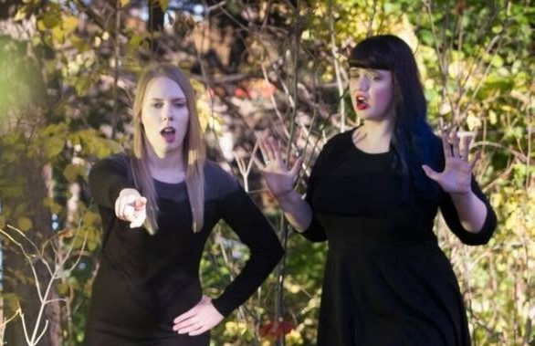

---
authors:
- admin
categories:
- Breaking News
- Shocking
date: "2020-10-14T00:00:00Z"
draft: false
featured: false
image:
  caption: ""
  focal_point: ""
lastmod: "2020-10-14T00:00:00Z"
projects: []
subtitle: It's Official
summary: Officially the coolest people
tags:
- Breaking News
- Shocking
title: 'The Coolest People'
---

Samantha Bean and Liz Walker are officially the coolest people.  
The final results are as follows:

##### Coolest People
&nbsp;&nbsp;1 -  Samantha Bean, Liz Walker (tie)  
&nbsp;&nbsp;3  
&nbsp;&nbsp;4  
&nbsp;&nbsp;5 - Beyoncé

The margin of victory was so great that third and fourth place finishers were not named. Neither Bean nor Walker were interviewed for this article but our investigative team did gather briefly in the break room. Analysis of speculation from that conversation suggests the winners reaction might have looked something like:

### Surprise to Some
The result was a surprise to some. While Bean had been an early betting favorite, Walker's (some say aggressive) PR strategy paid off in the years leading up to the final vote.

We imagine [Beyoncé](https://en.wikipedia.org/wiki/Beyonc%C3%A9) thought to herself "really saw myself getting that fourth place so this feels like a setback."

### It's About the Libraries
As often happens when people decide who's coolest, this was about libraries. Once Bean and Walker had the support of the [Friends of the Hennepin County Library](https://www.supporthclib.org/meet-our-library-fundraisers) the balance of coolness swung irreparably in their favor. Walker and Bean even appeared in the [HCL Fall Events Guide](https://www.supporthclib.org/2020-fall-events-guide) - that's like being toasted at the Met Gala only in the form of a downloadable pdf document.

Another imagined [Beyoncé](https://en.wikipedia.org/wiki/Popular_music) quote: "I thought they'd get some library support - Kanabec, Otter Tail or maybe Beltrami County Library, but Hennepin freaking County Libraries? How am I supposed to compete with that?" Beyoncé's hair dresser's college friend's neighbor could not be reached for [comment](https://en.wikipedia.org/wiki/Topic_and_comment).

### Perhaps It's Them
The world got to know Samantha Bean and Liz Walker through the ["Perhaps It's You"](https://perhapsitsyou.wordpress.com/) [podcast](https://podcasts.apple.com/us/podcast/perhaps-its-you/id1279107395) - cited by the [BBC](https://www.bbc.com/) as the number one podcast

Designation as the coolest people will only add to their [online merchandizing](https://teespring.com/stores/my-store-piy) presence.

---
**From Our Sponsors**

Meet singles [in your area](https://en.wikipedia.org/wiki/Rickrolling#/)!

---
