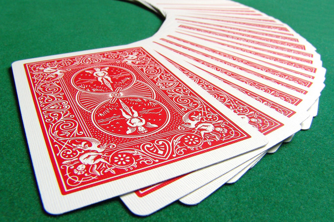
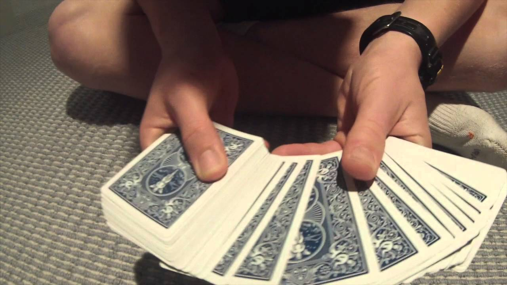
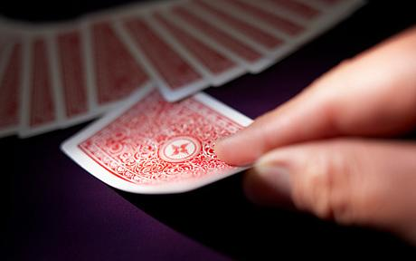
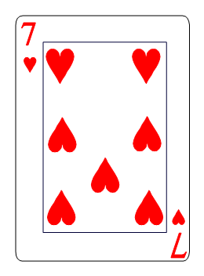

---
authors:
- Jimmy Doppelganger
categories:
- Magic
- Distraction
date: "2020-10-29T00:00:00Z"
draft: false
featured: false
image:
  caption: ""
  focal_point: ""
lastmod: "2020-10-29T00:00:00Z"
projects: []
subtitle: Blog Magic is the Best
summary: Magic on the Web
tags:
- Web Magic
- Distraction
title: 'Pick a Card'
---

Everyone loves magic tricks - in some countries it's a [legal](https://en.wikipedia.org/wiki/Law) requirement.

Card tricks can be performed on stage..

..or explained in a [math video](https://www.youtube.com/watch?v=BbnbfKbgf5Q)

..but card tricks and in fact all magic tricks are at their *very* best in blog form.

##### Ordinary Deck
We have an ordinary deck of cards.

I can make the deck change color before your eyes but oddly that is not the trick.

### Time to Choose
Pick a card, any card from this perfectly ordinary deck

- Look at your card

- Don't show it to *anyone*
- Remember your card
- Place it back in the deck

### The Art of Deception
My assistant will now distract the audience.

It's not clear which is more surprising
- that I need an assistant to do a card trick
- that my assistant is somehow Taylor Swift

### The Big Reveal
Now for the big moment [(drum roll)](https://www.freesoundslibrary.com/drum-roll-sound-effect/)

Is **this** your card!?

..and that's how it's done ladies and gentlemen.

Thank You
